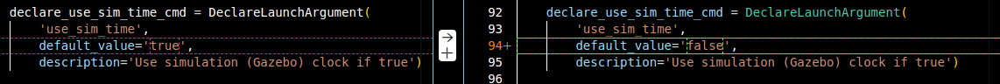
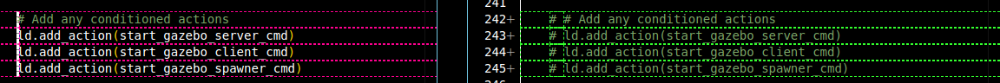
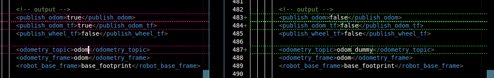
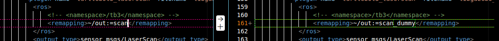
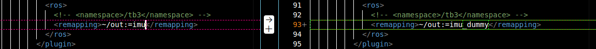

# Robot Navigation with Nav2 and Real Sensor Integration

This repository provides a Docker-based development environment for robot navigation using ROS 2 Navigation Stack (Nav2). It includes configurations for both simulated TurtleBot3 examples and real sensor integration with LiDAR.

## Table of Contents
- [Development Workflow](#development-workflow)
- [Prerequisites](#prerequisites)
- [Quick Start: TurtleBot3 Simulation](#quick-start-turtlebot3-simulation)
- [Real Sensor Integration](#real-sensor-integration)
- [Project Structure](#project-structure)
- [Troubleshooting](#troubleshooting)

## Development Workflow

### Branching Strategy
- **`develop`** - Use this branch for feature development and solid implementations
- **`master`** - Competition-ready, stable codebase only

### Development Process
1. **Pull** the latest changes from the repository
2. **Build** the Docker image
3. **Run** the Docker container with mounted source code (`app/`)
4. **Develop** on your host machine - changes reflect instantly in the container
5. **Test** and run scripts inside the container
6. **Commit** solid features to the `develop` branch

> **Remember:** Develop on your host, run in the container!

## Prerequisites

- Docker installed on your system
- X11 server for GUI applications
- (Optional) Livox LiDAR sensor for real sensor integration

### Enable Docker GUI Access

Before running any GUI applications, allow Docker to access your display:

```bash
xhost +local:docker
```

## Quick Start: TurtleBot3 Simulation

### 1. Build the Docker Image

From the repository root directory:

```bash
docker build -t corra09/nav2_docker:dev .
```

### 2. Run the Docker Container

```bash
docker run -it --privileged --net=host \
  --env="DISPLAY=$DISPLAY" \
  --env="QT_X11_NO_MITSHM=1" \
  --volume="/tmp/.X11-unix:/tmp/.X11-unix:rw" \
  --volume="./app/nav2_ws/src:/root/nav2_ws/src" \
  --volume="./app/initialize:/root/initialize" \
  --device /dev/dri:/dev/dri \
  corra09/nav2_docker:dev
```

> **Note:** Some options may need adjustment depending on your system configuration.

### 3. Launch the Simulation

Inside the Docker container:

```bash
ros2 launch nav2_bringup tb3_simulation_launch.py headless:=False
```

🎉 **Congratulations!** You can now interact with the default TurtleBot3 Nav2 example in Gazebo.

## Real Sensor Integration

This section describes how to integrate real sensor data (LiDAR) with the Nav2 stack, replacing simulated sensor data.

### Setup Steps

#### 1. Prepare the Environment

Follow steps 1-2 from the [Quick Start](#quick-start-turtlebot3-simulation) section to build and run the Docker container.

#### 2. Connect Your LiDAR Sensor

Power on your Livox LiDAR and connect it to your computer via Ethernet.

Troubleshooting:
- Check network connection to LiDAR
- Verify sensor IP configuration matches your network setup

#### 3. Modify the nav2 package

The following modifications disable simulation components and prepare the system to receive real sensor data:

##### a) Disable Simulated Time

**File:** `app/nav2_ws/src/navigation2/nav2_bringup/launch/tb3_simulation_launch.py`

Set `use_sim_time` to `False`:



##### b) Disable Gazebo

**File:** `app/nav2_ws/src/navigation2/nav2_bringup/launch/tb3_simulation_launch.py`

Comment out or remove the Gazebo launch configuration:



##### c) Detach Simulated Odometry

**File:** `app/nav2_ws/src/navigation2/nav2_bringup/worlds/waffle.model`

Remove or disable the odometry plugin to prevent the simulated model from publishing on `/odom`:



##### d) Detach Simulated Scan

**File:** `app/nav2_ws/src/navigation2/nav2_bringup/worlds/waffle.model`

Remove or disable the LiDAR plugin to prevent publishing on `/scan`:



##### e) Detach Simulated IMU

**File:** `app/nav2_ws/src/navigation2/nav2_bringup/worlds/waffle.model`

Remove or disable the IMU plugin:



#### 4. Launch the Sensor Package

Inside the Docker container, start the sensor launcher to publish real sensor data:

```bash
ros2 launch sensor_launcher launch.py
```

This will publish essential topics: `/scan`, `/odom`, `/tf`, `/tf_static`, etc.

#### 5. Launch Nav2 with Real Sensor Data

In a new terminal (inside the container):

```bash
ros2 launch nav2_bringup tb3_simulation_launch.py headless:=False
```

Nav2 will now consume data from your real sensors instead of simulation.

### Additional Configuration Required

To fully integrate real sensors with Nav2, you need to address the following:

#### Map Configuration
- Replace the default TurtleBot3 map with a map of your actual environment
- Update the map file path in the launch configuration

#### Parameter Tuning
- **File:** `app/nav2_ws/src/navigation2/nav2_bringup/params/nav2_params.yaml`
- Tune parameters for your specific robot and environment

#### Transform Tree (TF) Configuration
- The URDF of the Waffle robot is still loaded by default (it's not such a big issue)
- Verify anyway that sensor frames are correctly transformed relative to the base frame
- Use `rqt_tf_tree` to visualize and debug the transform tree:
  ```bash
  ros2 run rqt_tf_tree rqt_tf_tree
  ```
- Ensure proper frame relationships: `base_link` → `sensor_frame`

#### Testing Localization (AMCL)
Only after completing the above configurations should you test the AMCL (Adaptive Monte Carlo Localization) module for robot localization.

## Project Structure

```
roboto_navigation/
├── app/
│   ├── initialize/          # Initialization scripts and Gazebo models
│   └── nav2_ws/
│       └── src/
│           ├── navigation2/      # Nav2 stack (modified)
│           ├── sensor_launcher/  # Real sensor integration package
│           ├── FAST_LIO_ROS2/   # LiDAR odometry
│           ├── livox_converter/ # Livox sensor converter
│           ├── Livox-SDK2/      # Livox SDK
│           └── pointcloud_to_laserscan/
├── notes/                   # Documentation and reference images
├── Dockerfile              # Docker environment definition
└── README.md              # This file
```


## Package Attribution

This project integrates several third-party ROS2 packages alongside custom-developed packages:

### Third-Party Packages (from GitHub)

The following packages are based on open-source GitHub repositories:

- **navigation2** - ROS 2 Navigation Stack  
  Repository: `https://github.com/ros-planning/navigation2`

- **FAST_LIO_ROS2** - Fast LiDAR-Inertial Odometry  
  Repository: `https://github.com/Ericsii/FAST_LIO_ROS2`

- **Livox-SDK2** - Livox LiDAR SDK  
  Repository: `https://github.com/Livox-SDK/Livox-SDK2`

- **pointcloud_to_laserscan** - Point cloud to laser scan converter  
  Repository: `https://github.com/ros-perception/pointcloud_to_laserscan`

- **ws_livox** - Livox ROS2 driver workspace  
  Repository: `https://github.com/Livox-SDK/livox_ros_driver2`

### Custom Packages

The following packages were developed specifically for this project:

- **livox_converter** - Custom converter for Livox sensor data processing
- **sensor_launcher** - Custom launch package for real sensor integration

## Contributing

When contributing to this repository:
1. Create a feature branch from `develop`
2. Make your changes and test thoroughly
3. Commit with clear, descriptive messages
4. Merge to `develop` for review
5. Only merge to `master` when competition-ready

